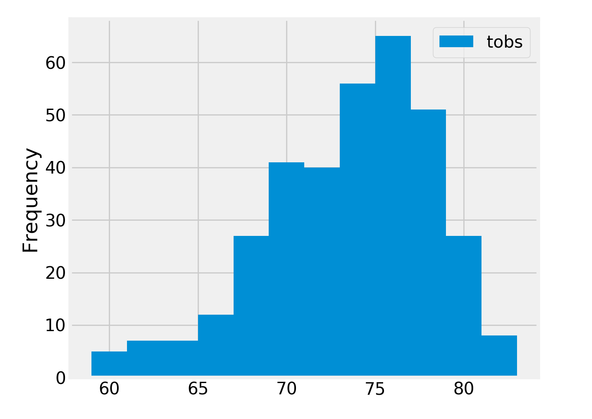

<!--lint disable no-heading-punctuation-->
# Climate Analysis
<!--lint enable no-heading-punctuation-->

## Step 1 - Data Engineering

The climate data for Hawaii is provided through two CSV files. Start by using Python and Pandas to inspect the content of these files and clean the data.

* Create a Jupyter Notebook file called `data_engineering.ipynb` and use this to complete all of your Data Engineering tasks.

* Use Pandas to read in the measurement and station CSV files as DataFrames.

* Inspect the data for NaNs and missing values. You must decide what to do with this data.

* Save your cleaned CSV files with the prefix `clean_`.

---

## Step 2 - Database Engineering

Use SQLAlchemy to model your table schemas and create a sqlite database for your tables. You will need one table for measurements and one for stations.

* Create a Jupyter Notebook called `database_engineering.ipynb` and use this to complete all of your Database Engineering work.

* Use Pandas to read your cleaned measurements and stations CSV data.

* Use the `engine` and connection string to create a database called `hawaii.sqlite`.

* Use `declarative_base` and create ORM classes for each table.

  * You will need a class for `Measurement` and for `Station`.

  * Make sure to define your primary keys.

* Once you have your ORM classes defined, create the tables in the database using `create_all`.

---

## Step 3 - Climate Analysis and Exploration

You are now ready to use Python and SQLAlchemy to do basic climate analysis and data exploration on your new weather station tables. All of the following analysis should be completed using SQLAlchemy ORM queries, Pandas, and Matplotlib.

* Create a Jupyter Notebook file called `climate_analysis.ipynb` and use it to complete your climate analysis and data exporation.

* Choose a start date and end date for your trip. Make sure that your vacation range is approximately 3-15 days total.

* Use SQLAlchemy `create_engine` to connect to your sqlite database.

* Use SQLAlchemy `automap_base()` to reflect your tables into classes and save a reference to those classes called `Station` and `Measurement`.

### Precipitation Analysis

* Design a query to retrieve the last 12 months of precipitation data.

* Select only the `date` and `prcp` values.

* Load the query results into a Pandas DataFrame and set the index to the date column.

* Plot the results using the DataFrame `plot` method.

* Use Pandas to print the summary statistics for the precipitation data.

### Station Analysis

* Design a query to calculate the total number of stations.

* Design a query to find the most active stations.

  * List the stations and observation counts in descending order

  * Which station has the highest number of observations?

* Design a query to retrieve the last 12 months of temperature observation data (tobs).

  * Filter by the station with the highest number of observations.

  * Plot the results as a histogram with `bins=12`.

  

### Temperature Analysis

* Write a function called `calc_temps` that will accept a start date and end date in the format `%Y-%m-%d` and return the minimum, average, and maximum temperatures for that range of dates.

* Use the `calc_temps` function to calculate the min, avg, and max temperatures for your trip using the matching dates from the previous year (i.e. use "2017-01-01" if your trip start date was "2018-01-01")

* Plot the min, avg, and max temperature from your previous query as a bar chart.

  * Use the average temperature as the bar height.

  * Use the peak-to-peak (tmax-tmin) value as the y error bar (yerr).

